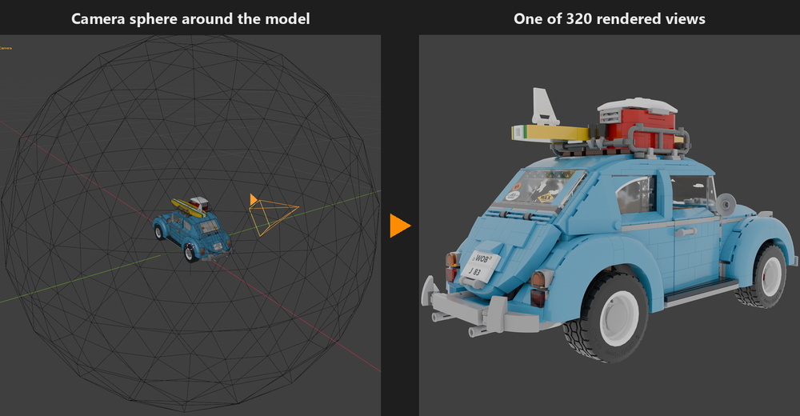

# Gaussian Render Capture – synthetic COLMAP datasets for Gaussian Splatting

A Blender add-on that turns a 3D model into a ready-to-train dataset for Gaussian Splatting.
It places cameras on a sphere around your model, renders one image per camera and exports
a COLMAP dataset – images, exact camera poses and a start point cloud – for
[Postshot](https://www.jawset.com/) and [LichtFeld Studio](https://github.com/MrNeRF/LichtFeld-Studio).

A built-in step-by-step guide leads through it; blue buttons show the next action, red status
lines what is still missing.

**See the result in your browser** – the example of the tutorial, trained from one dataset
(320 views) with both trainers:
[Postshot result on SuperSplat](https://superspl.at/scene/04caae8c) ·
[LichtFeld Studio result in the LichtFeld gallery](https://portal.lichtfeld.io/gallery/s/S5BcEp7xgtTaVIfsgpa2ygW0Pg_zsnMm/)

Example model: LDraw model of set 10252 by Roland Dahl (RolandD), CC BY 2.0 – included in
[examples/10252_Volkswagen_Beetle](examples/10252_Volkswagen_Beetle/).

## Documentation

- **[Tutorial](docs/TUTORIAL.md)** – the whole workflow step by step, with screenshots
- **[Quick start](docs/QUICKSTART.md)** – the same on one page
- **[Reference](docs/REFERENCE.md)** – every setting explained
- **[Troubleshooting](docs/TROUBLESHOOTING.md)** · **[Glossary](docs/GLOSSARY.md)** ·
  **[Known issues](docs/KNOWN_ISSUES.md)** · **[Changelog](CHANGELOG.md)**

## Highlights

- **Guide** for beginners, one step at a time, with checks.
- **Prepare Scene** sets up Cycles on the GPU with capture render settings.
- **Camera sphere** – 20 to 1280 cameras; *Fill Each View* and *Center in Each View* make the
  model fill and centre every square image.
- **Scene versions** – `<Name>_v001.blend` renders and exports into its own dataset folder
  `<Name>_COLMAP/v001/`; versions never mix.
- **Live Camera Adjust** – fine-tune one view or the whole sphere through the camera.
- **Start point cloud** from all model vertices plus surface points; a GPU visibility filter drops
  hidden inner parts.
- **Auto scale** with the factor recorded in `<vNNN>_gcapture_export.json` next to the dataset, so a
  trained splat can be placed back onto the model.

## Install

Blender 4.1 or later. Tested on Windows 11 (4.1, 4.4, 4.5, 5.0, 5.2, 5.3) and with the automated
test suite on Linux (Ubuntu) and macOS (Apple Silicon) with Blender 4.1 and 5.2. GPU rendering on
AMD, Intel and Apple GPUs has not been tried yet – reports are welcome in the
[issues](https://github.com/virtualrepublic/Gaussian-Render-Capture/issues).

For training: Postshot runs on Windows, LichtFeld Studio on Windows and Linux with an NVIDIA GPU.
On macOS use a trainer that reads COLMAP datasets.

1. *Edit → Preferences → Add-ons → Install from Disk…* and pick `gaussian_capture.py`.
2. Enable **Gaussian Render Capture** (disable any older version first).
3. The panel is in the 3D viewport sidebar (N), tab **Gaussian Render Capture** – press **Start Guide**.

**Upgrading from Gaussian Render Scan (1.0.x)** – the add-on was renamed in 1.1.0. Disable and
remove *Gaussian Render Scan*, then install `gaussian_capture.py`. Scenes made with it are taken
over automatically when you open them (settings, camera sphere, live adjustments); save them to
keep the new names.

## Licence and credits

Copyright (C) 2026 Prof. Michael Klein. Licensed under GPL-3.0-or-later (see [LICENSE](LICENSE)).

Started from [Gauss Cannon](https://github.com/warpgatelabs/gauss-cannon) by Warpgate Labs
(GPL-3.0-or-later); today only its ray-casting helpers remain (interior-camera test, CPU
fallback of the visibility filter). Details and all other third-party notices:
[THIRD_PARTY.md](THIRD_PARTY.md).

Prof. Michael Klein – Digital Film Design, Animation/VFX,
Mediadesign University of Applied Sciences ·
[mediadesign.de](https://www.mediadesign.de) · [virtualrepublic.org](https://www.virtualrepublic.org) ·
[renderbricks.com](https://www.renderbricks.com)

**Transparency note on the use of AI:** the add-on, its tests and this documentation were
developed with Anthropic Claude (Claude Code) as a programming and writing assistant. The concept,
the design decisions, the tests in Blender, Postshot and LichtFeld Studio and the acceptance of
every version are the author's; he is responsible for the content.

LEGO® is a trademark of the LEGO Group; this and all other trademarks named here belong to their
owners, none of whom sponsors, authorises or endorses this project (see [THIRD_PARTY.md](THIRD_PARTY.md)).
