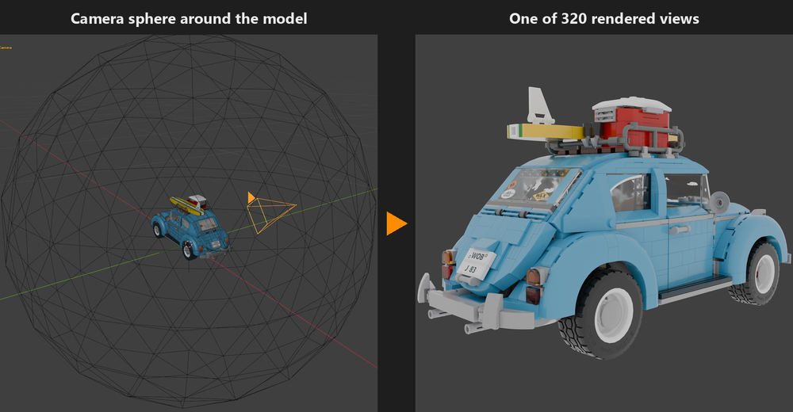
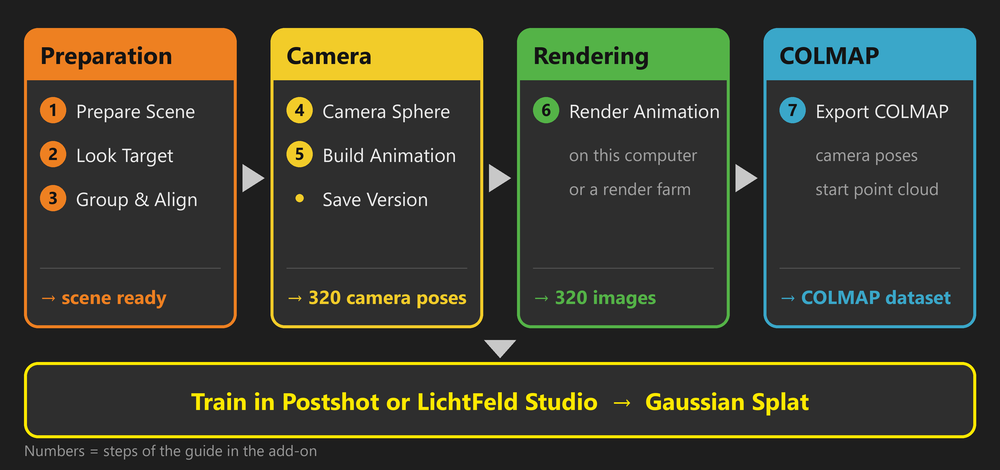

# Gaussian Render Capture – synthetic COLMAP datasets for Gaussian Splatting

A Blender add-on that turns a 3D model into a ready-to-train dataset for Gauss­ian Splat­ting.
It places cam­eras on a sphere around your model, ren­ders one image per camera and exports
a COLMAP dataset – images, exact camera poses and a start point cloud – for
[Post­shot](https://www.jawset.com/) and [LichtFeld Studio](https://github.com/MrNeRF/LichtFeld-Studio).
It started from [Gauss Cannon](https://github.com/warpgatelabs/gauss-cannon) by Arash Kesh­mirian –
thanks for the impulse.

A built-in step-by-step guide leads through it; blue but­tons show the next action, red status
lines what is still miss­ing.

**See the result in your browser** – the exam­ple of the tuto­rial, trained from one dataset
(320 views) with both train­ers:
[Post­shot result on SuperSplat](https://superspl.at/scene/04caae8c) ·
[LichtFeld Studio result in the LichtFeld gallery](https://portal.lichtfeld.io/gallery/s/S5BcEp7xgtTaVIfsgpa2ygW0Pg_zsnMm/)

Example model: LDraw model of set 10252 by Roland Dahl (RolandD), CC BY 2.0 – included in
[exam­ples/10252_Volkswagen_Beetle](examples/10252_Volkswagen_Beetle/).

## Documentation

- **[Tuto­rial](docs/TUTORIAL.md)** – the whole work­flow step by step, with screen­shots
- **[Quick start](docs/QUICKSTART.md)** – the same on one page
- **[Ref­er­ence](docs/REFERENCE.md)** – every set­ting explained
- **[Trou­bleshoot­ing](docs/TROUBLESHOOTING.md)** · **[Glos­sary](docs/GLOSSARY.md)** ·
  **[Known issues](docs/KNOWN_ISSUES.md)** · **[Changelog](CHANGELOG.md)**

## Highlights

- **Guide** for begin­ners, one step at a time, with checks.
- **Prepare Scene** sets up Cycles on the GPU with cap­ture render set­tings.
- **Camera sphere** – 20 to 1280 cam­eras; *Fill Each View* and *Center in Each View* make the
  model fill and centre every square image.
- **Scene ver­sions** – `<Name>_v001.blend` ren­ders and exports into its own dataset folder
  `<Name>_COLMAP/v001/`; ver­sions never mix.
- **Live Camera Adjust** – fine-tune one view or the whole sphere through the camera.
- **Render from the panel** – PNG or TIFF; *Render EEVEE* (fast) or *Render Cycles* (exact); or *Command Line
  Render*: a double-click script ren­ders head­less while Blender stays free.
- **Start point cloud** from all model ver­tices plus sur­face points, in the mate­rial colours; a
  GPU vis­i­bil­ity filter drops hidden inner parts.
- **Auto scale** with the factor recorded in `<vNNN>_gcapture_export.json` next to the dataset, so a
  trained splat can be placed back onto the model.
- **Clean Splat** – after train­ing, removes floaters from the trained splat with the model's depth
  per camera: no ren­der­ing, a few sec­onds, the orig­i­nal file stays.

## Install

Blender 4.1 or later. Tested by hand on Windows 11 (4.1, 4.4, 4.5, 5.0, 5.2, 5.3). On Linux
(Ubuntu) and macOS (Apple Silicon) only the auto­mated test suite has run, with Blender 4.1 and 5.2,
on GitHub's vir­tual test machines – not yet on phys­i­cal com­put­ers. GPU ren­der­ing on AMD, Intel and
Apple GPUs has not been tried yet – reports are wel­come in the
[issues](https://github.com/virtualrepublic/Gaussian-Render-Capture/issues).

For train­ing: Post­shot runs on Windows, LichtFeld Studio on Windows and Linux with an NVIDIA GPU.
On macOS use a trainer that reads COLMAP datasets.

**[⬇ Latest release](https://github.com/virtualrepublic/Gaussian-Render-Capture/releases/latest)** – down­load `gaussian_capture-<version>.zip` there; do not unpack it.

1. *Edit → Pref­er­ences → Add-ons → Install from Disk…* and pick the down­loaded ZIP. Blender 4.2
   and later install it as an exten­sion, Blender 4.1 as an add-on.
2. Enable **Gauss­ian Render Capture** (dis­able any older ver­sion first).
3. The panel is in the 3D view­port side­bar (N), tab **Gauss­ian Render Capture** – press **Start Guide**.

**Updat­ing from 1.3.0 or older** – up to 1.3.0 the add-on was a single file. First remove the old
*Gauss­ian Render Capture* (`gaussian_capture.py`) in *Pref­er­ences → Add-ons*, then install the ZIP;
enabling the new ver­sion next to the old one is refused with a mes­sage. Your scenes keep all
set­tings.

**Upgrad­ing from Gauss­ian Render Scan (1.0.x)** – the add-on was renamed in 1.1.0. Disable and
remove *Gauss­ian Render Scan*, then install the ZIP. Scenes made with it are taken
over auto­mat­i­cally when you open them (set­tings, camera sphere, live adjust­ments); save them to
keep the new names.

## Related projects

- **[Gauss Cannon](https://github.com/warpgatelabs/gauss-cannon)** by Arash Kesh­mirian (Warp­gate
  Labs) – the add-on this one started from. Camera paths from helper meshes, a ray-traced coloured
  point cloud and camera export for LichtFeld Studio and Post­shot.

## Licence and credits

Copy­right (C) 2026 Prof. Michael Klein; por­tions (ray-cast­ing helpers) Copy­right (C) 2025 Arash
Kesh­mirian / Warp­gate Labs. Licensed under GPL-3.0-or-later (see [LICENSE](LICENSE)).

Started from [Gauss Cannon](https://github.com/warpgatelabs/gauss-cannon) by Arash Kesh­mirian
(Warp­gate Labs, GPL-3.0-or-later); today only its ray-cast­ing helpers remain (inte­rior-camera test, CPU
fall­back of the vis­i­bil­ity filter). Details and all other third-party notices:
[THIRD_PARTY.md](THIRD_PARTY.md).

[Prof. Michael Klein](https://www.linkedin.com/in/virtualrepublic/) 
[Digital Film Design – Ani­ma­tion/VFX](https://www.mediadesign.de/en/bachelor/digital-film-design-animation-vfx-ba) ·
[Medi­ade­sign Uni­ver­sity of Applied Sci­ences](https://www.mediadesign.de) 
[medi­ade­sign.de](https://www.mediadesign.de) · [vir­tu­al­re­pub­lic.org](https://www.virtualrepublic.org) ·
[ren­der­bricks.com](https://www.renderbricks.com)

**Trans­parency note on the use of AI:** the author is not a pro­gram­mer but has worked in CGI
since 1987. The add-on was devel­oped entirely through vibe coding with Anthropic Claude
(Claude Code): Claude wrote the code, the tests and this doc­u­men­ta­tion from his descrip­tions. The
con­cept, the design deci­sions, the tests in Blender, Post­shot and LichtFeld Studio and the
accep­tance of every ver­sion are the author's; he is respon­si­ble for the con­tent.

LEGO® is a trade­mark of the LEGO Group; this and all other trade­marks named here belong to their
owners, none of whom spon­sors, autho­rises or endorses this project (see [THIRD_PARTY.md](THIRD_PARTY.md)).

