# Tutorial – from a Blender model to a Gaussian Splat

This tutorial takes you through the whole workflow once, step by step. It uses an LDraw model of a
classic Beetle as example – set 10252, modelled by Roland Dahl (RolandD), CC BY 2.0; the file is in
[examples/10252_Volkswagen_Beetle](../examples/10252_Volkswagen_Beetle/). The numbers in brackets are
the values of that example.

**You need:** Blender 4.1 or later with the add-on installed ([Install](#0-install-the-add-on)),
a model you want to turn into a Gaussian Splat, and a Gaussian Splatting trainer –
[Postshot](https://www.jawset.com/) or [LichtFeld Studio](https://github.com/MrNeRF/LichtFeld-Studio).

**Time:** about 15 minutes of work. Rendering and training run on their own afterwards.

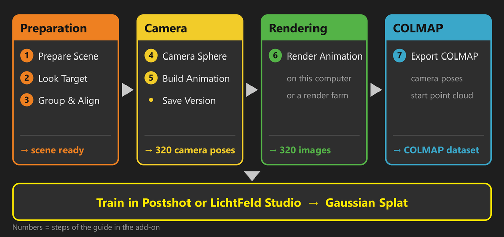

**How the idea works:** a real Gaussian Splat is trained from many photos of an object taken from
all sides. The add-on does the same with a virtual camera: it places cameras on a sphere around
your model, renders one image per camera and writes a *COLMAP dataset* – the images plus the exact
position of every camera and a cloud of start points. A trainer turns that dataset into a splat.
Because the camera positions are known exactly, the usual photo-alignment step is not needed.

Every step below has the same structure: **what it is for**, the **numbered actions** (the
numbers match the yellow markers in the picture), a **check** that tells you it worked, and an
optional **why** for the curious.

Contents: [0 Install](#0-install-the-add-on) · [Start the guide](#start-the-guide) ·
[1 Scene & Camera](#step-1-scene--camera) · [2 Look Target](#step-2-look-target) ·
[3 Group & Align](#step-3-group--align-to-ground) · [4 Camera Sphere](#step-4-camera-sphere) ·
[5 Build](#step-5-build-the-camera-animation) · [6 Render](#step-6-render) ·
[7 Export](#step-7-colmap-export) · [Train](#then-train-the-splat) ·
[The dataset](#what-the-dataset-contains)

---

## 0. Install the add-on

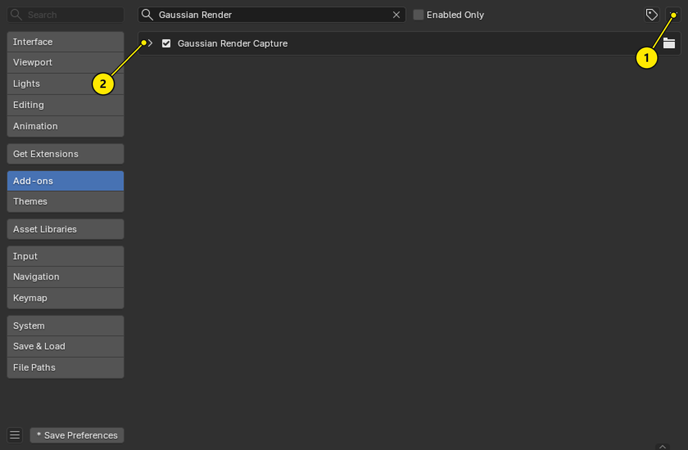

**[⬇ Download gaussian_capture.py](https://github.com/virtualrepublic/Gaussian-Render-Capture/releases/latest/download/gaussian_capture.py)** (latest release)

1. *Edit → Preferences → Add-ons*, open the menu at the top right and choose
   **Install from Disk…**, then pick `gaussian_capture.py`.
2. Tick **Gaussian Render Capture** to enable it.

**Check:** in the 3D viewport, press **N** – the sidebar has a tab **Gaussian Render Capture**.

> Blender 4.1 has the same button as *Install…* at the top of the Add-ons page.

---

## Start the guide

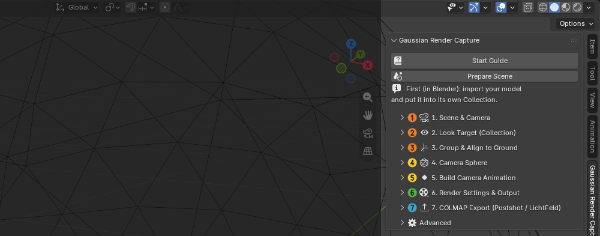

Import your model first and put it into a collection of its own (*M → New Collection* in the
viewport). Then open the sidebar tab **Gaussian Render Capture** and press **Start Guide**.

The guide shows one step at a time. Two colours tell you what to do:

- **Blue button** – this is the action the step needs. It stays blue until the step is done.
- **Red status line** at the bottom – something is still missing. It turns into a green tick when
  the step is complete, and **Next** turns blue.

You can leave the guide with **Exit** at any time; all sections are then shown as a normal panel.

---

## Step 1: Scene & Camera

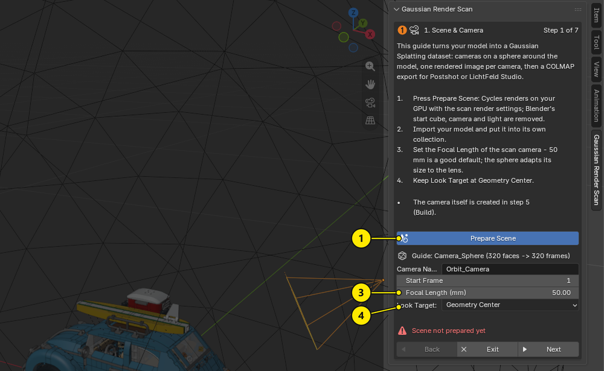

**What it is for:** sets Blender up for the capture renders and chooses the camera lens.

1. Press **Prepare Scene**. Cycles now renders on your graphics card, with the render settings
   that suit a capture (1024 samples, denoising, transparent background). Blender's start cube,
   camera and light are removed – only if you did not change them.
2. Import your model and put it into its own collection (if not done yet).
3. Set the **Focal Length** of the capture camera – 50 mm is a good default.
4. Keep **Look Target** at *Geometry Center*.

**Check:** the status line says *Scene prepared (Cycles on GPU)*.

Why?

Prepare Scene chooses the fastest graphics card backend it finds (OptiX, CUDA, HIP, Metal, oneAPI)
and switches the processor off for rendering. The camera itself is only created in step 5; the
sphere in step 4 adapts its size to the lens, so a longer lens simply moves the cameras further
away.

---

## Step 2: Look Target

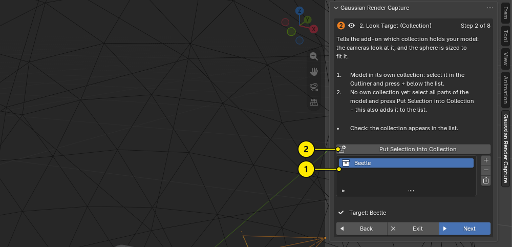

**What it is for:** tells the add-on which collection holds your model. The cameras look at it and
the sphere is sized to fit it.

1. If your model already has its own collection: select the collection in the Outliner and press
   **+** next to the list.
2. If not: select all parts of the model and press **Put Selection into Collection**. If a
   collection of that name exists, it is used.

**Check:** the collection appears in the list (*Beetle*), the status line shows *Target: Beetle*.
The viewport frames the model.

---

## Step 3: Group & Align to Ground

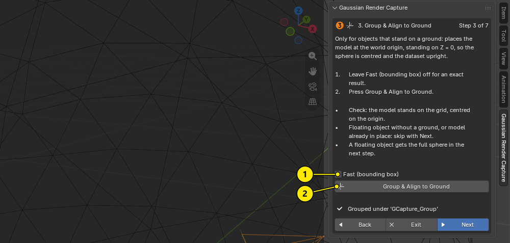

**What it is for:** *only for objects that stand on a ground.* Puts the model at the world origin,
standing on Z = 0, so the sphere is centred and the dataset stands upright.

1. Leave **Fast (bounding box)** off for an exact result.
2. Press **Group & Align to Ground**.

**Check:** the model stands on the grid, centred on the origin; the status line says
*Grouped under 'GCapture_Group'*.

A floating object (no ground), or a model that is already in place: skip this step with **Next**.

---

## Step 4: Camera Sphere

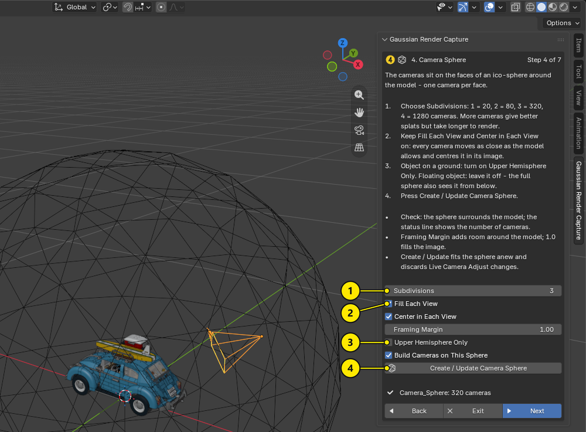

**What it is for:** creates the sphere whose faces become the camera positions – one camera per
face.

1. Choose **Subdivisions**: 1 = 20, 2 = 80, **3 = 320** (example), 4 = 1280 cameras. More cameras
   give better splats but take longer to render.
2. Keep **Fill Each View** and **Center in Each View** on.
3. Object on a ground: turn on **Upper Hemisphere Only**. Floating object: leave it off – the
   full sphere also sees it from below.
4. Keep **Build Cameras on This Sphere** on and press **Create / Update Camera Sphere**.

**Check:** a wireframe sphere surrounds the model; the status line shows *Camera_Sphere: 320
cameras*. Camera and sphere live in their own collection *Capture_Rig*.

Why Fill Each View and Center in Each View?

With **Fill Each View** every camera moves along its line of sight until the model fills its
image – from the front the model is wider than from above, so each camera gets its own distance.
**Center in Each View** also shifts every camera sideways, keeping its direction, until the model
sits in the middle of the square image. Together they give the most detail per image:

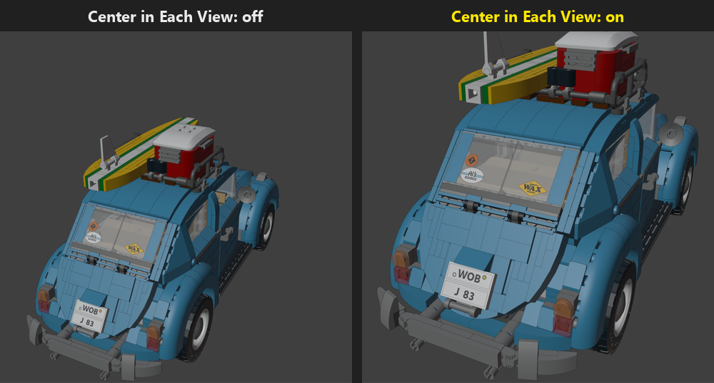

*Framing Margin* adds room around the model; 1.0 fills the image edge to edge.

---

## Step 5: Build the camera animation

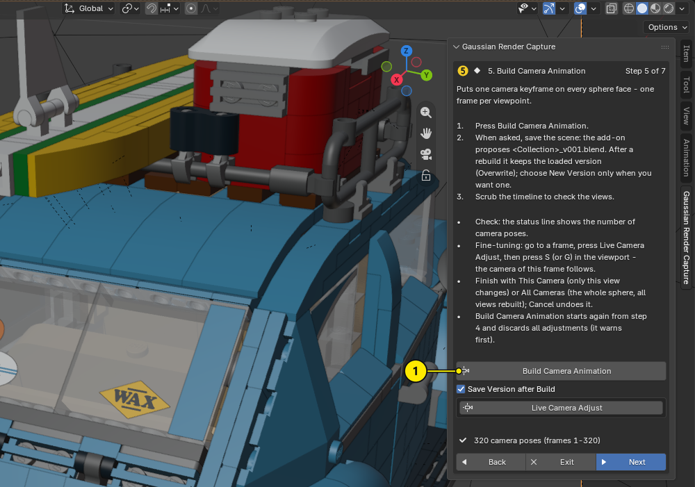

**What it is for:** creates the capture camera and gives it one keyframe per sphere face – frame 1 is
the first view, frame 320 the last.

1. Press **Build Camera Animation**.
2. The add-on asks you to save the scene as a *version* – see below.
3. Scrub the timeline to look at the views (numpad 0 shows the camera view).

**Check:** the status line shows *320 camera poses (frames 1–320)*.

### Saving versions

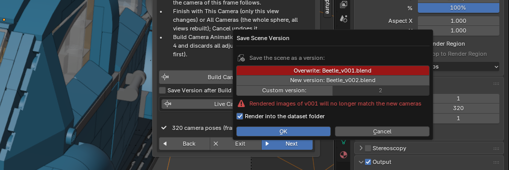

Every version of your scene gets its own dataset folder, so renders and exports of different
versions never mix. The first save proposes `<Collection>_v001.blend` (here `Beetle_v001.blend`).
Later the dialog offers:

- **Overwrite** (red) – keeps the loaded version. Offered only when the loaded file is the highest
  version in the folder.
- **New version** (blue when chosen) – the next free number, e.g. `Beetle_v002.blend`.
- **Custom version** – a number of your choice.

Keep **Render into the dataset folder** on: the render output then goes straight into the
dataset of this version. If you render into a folder of your own (set in the Output tab), the
dialog leaves it alone.

### Fine-tuning single views: Live Camera Adjust

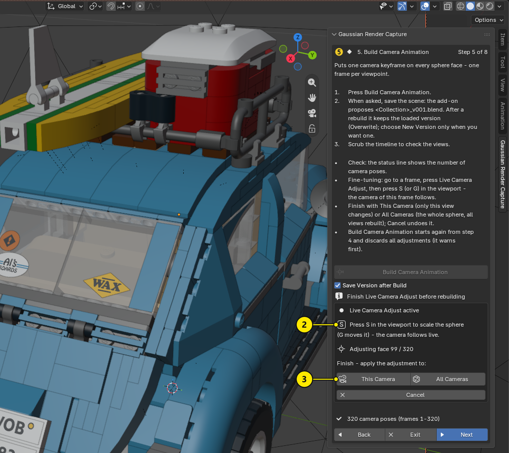

1. Go to the frame whose view you want to change and press **Live Camera Adjust**.
2. Press **S** (scale) or **G** (move) in the viewport – the camera of this frame follows the
   sphere.
3. Finish with **This Camera** (only this view changes), **All Cameras** (the whole sphere, all
   views are rebuilt) or **Cancel**.

Pressing **Build Camera Animation** again starts over from the step 4 settings and discards all
adjustments – the panel shows a red warning and Build asks before it does so.

---

## Step 6: Render

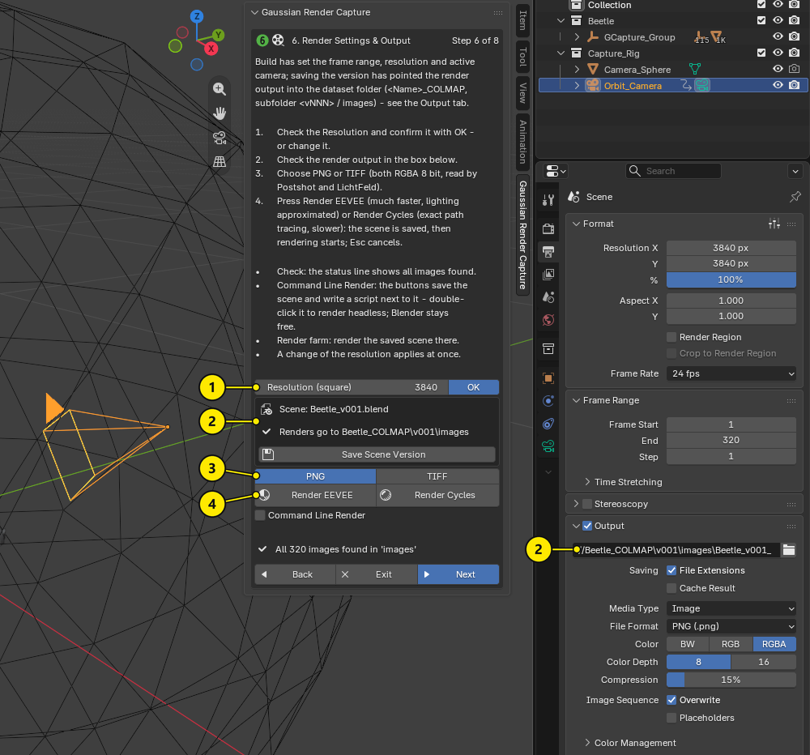

**What it is for:** renders one image per camera into the dataset folder.

1. Check the **Resolution** and confirm it with **OK** – or change it (example: 3840 px).
2. Check the render output: the box says `Renders go to Beetle_COLMAP\v001\images`. The guide has
   opened the **Output** tab, where you see the same path.
3. Render the images: press **Render EEVEE** (much faster, lighting approximated) or
   **Render Cycles** (exact path tracing, slower). The button saves the scene first, so settings
   you changed just before are kept; then Blender's render window shows the progress. **Esc**
   cancels. On a
   render farm, render the saved scene there instead.

   *Command Line Render* (headless): with this option the buttons read **Write EEVEE .cmd** /
   **Write Cycles .cmd**. They save the scene and write a script next to it, e.g.
   `Beetle_v001_render_eevee.cmd`. Double-click it to render without Blender's interface –
   Blender stays free, and the render goes on when you close Blender. On macOS the script is a
   `.command`, on Linux a `.sh`.

How does Command Line Render work – on Windows, macOS and Linux?

The script starts Blender without its interface:
`blender -b <Scene>.blend -a` (plus `-- --cycles-device <GPU>` for Cycles).
`-b` loads the scene in the background, `-a` renders the whole animation with the frame range,
engine, resolution and output path **of the saved file** – that is why the buttons save first.
The terminal shows the progress frame by frame; **Ctrl+C** cancels. The script calls exactly the
Blender that wrote it, so it runs on the system where it was written.

- **Windows** – double-click the `.cmd`. The window stays open at the end until you press a key.
- **macOS** – double-click the `.command`; the Finder runs it in the Terminal. Cycles and EEVEE
  render through Metal, no display needed. The first time, macOS may refuse a file from an
  unidentified developer: right-click → *Open* and confirm once.
- **Linux** – double-click the `.sh` if your file manager may run scripts, otherwise run
  `./<Scene>_render_eevee.sh` in a terminal. Cycles also renders on a machine without a display
  (e.g. over SSH). EEVEE needs a graphics session; on a server without a display start it through
  a virtual one: `xvfb-run -a ./<Scene>_render_eevee.sh`. To keep it running after you log out:
  `nohup ./<Scene>_render_cycles.sh &`.

If Blender's interface stays open during the render, both share the graphics card and its memory –
for large scenes close the interface.

**Check:** the status line turns green: *All 320 images found in 'images'*.

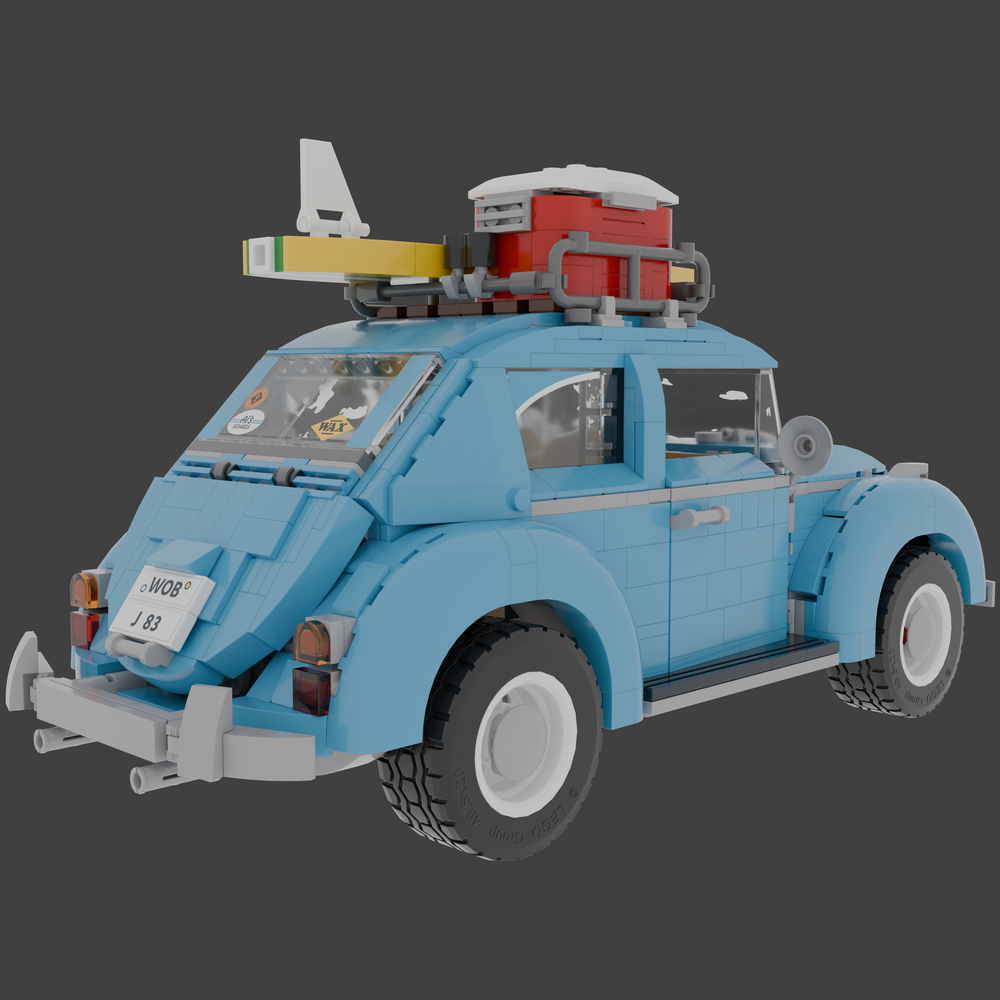

*One of the 320 rendered views. The background is transparent; the trainer only learns the model.*

Why square images and a transparent background?

All cameras use the same square image, so the model can fill every view equally. The transparent
background keeps the splat free of floaters around the model. The render settings for this come
from *Prepare Scene*; the switches that make the scene render exactly one image per camera are
under *Advanced → Render Setup* and should stay on.

---

## Step 7: COLMAP Export

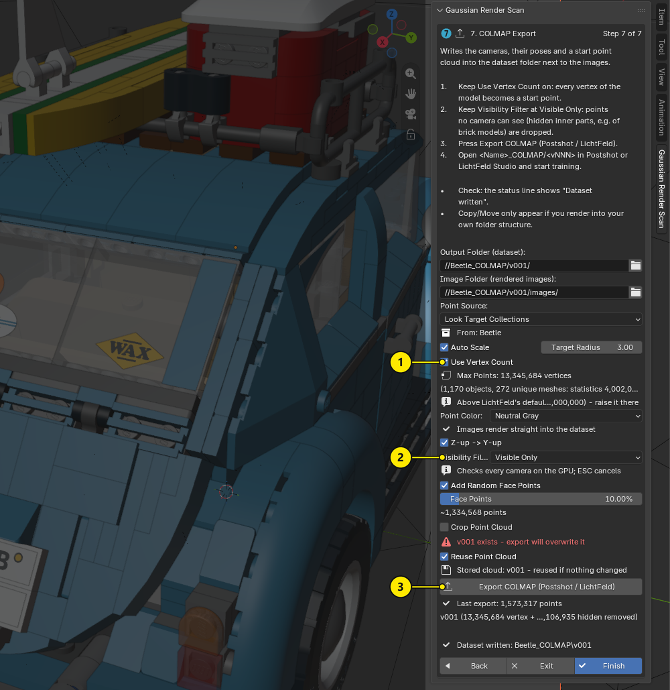

**What it is for:** writes the camera poses and a start point cloud next to the images – the
finished dataset for the trainer.

The panel groups the settings into **Dataset** (where the dataset and the images are),
**Start Points** (what goes into the point cloud) and **Scale & Axes**. The defaults fit most
models; while the export runs, a progress bar replaces the button and **Esc** cancels.

1. Keep **Use Vertex Count** on: every vertex of the model becomes a start point.
2. Keep **Visibility Filter** at **Visible Only**: points no camera can see (hidden inner parts)
   are dropped.
3. Press **Export COLMAP (Postshot / LichtFeld)**.

**Check:** the status line shows `Dataset written: Beetle_COLMAP\v001`. The report at the bottom of Blender
names the number of points and the scale.

What do the fields mean?

- **Output Folder** and **Image Folder** show the real paths of this version
  (`//Beetle_COLMAP/v001/` and `.../images/`). They follow the version automatically; a folder you
  type in yourself is left alone.
- **Point Source** – the start points come from the look-target collection (*From: Beetle*).
- **Add Random Face Points** adds points on large flat faces, 10 % of the vertex points by default.
- **Auto Scale** scales the dataset so the cameras are on average 3 units away from the centre.
  Very small or very large scenes densify badly in Postshot. The factor (example: 7.83 – the cameras
  orbit only 38 cm from the centre of this small model) is written to `v001_gcapture_export.json` next to the dataset
  folder.
- **Reuse Point Cloud** copies the last point cloud if nothing changed that affects it.

In the example 13.3 million vertices plus 1.3 million face points went in; the visibility filter
removed 13.1 million hidden points (inside the bricks), 1.57 million remained.

---

## Then: train the splat

Open the dataset folder of the version – `Beetle_COLMAP/v001`, the folder that contains `images`
and `sparse` – in your trainer.

### LichtFeld Studio

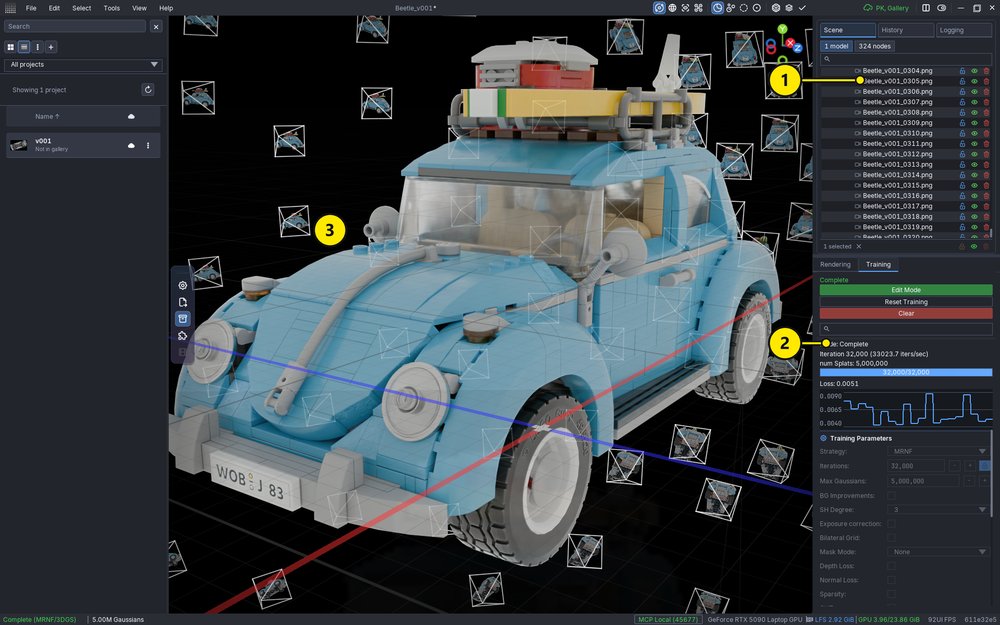

1. Load the dataset folder `Beetle_COLMAP/v001` in LichtFeld Studio. The 320 images appear in the
   scene list.
2. Start the training in the **Training** tab. The example ran with the defaults: strategy MRNF,
   32,000 iterations, at most 5,000,000 splats.
3. When it says *Complete*, the trained splat is shown together with all cameras (the small
   frames with the images). Save the project and export the splat, for example as `.ply` or
   `.sog` – in the example `Beetle_v001.licht` and `Model_32000.sog`.

From a command line the same training runs with
`LichtFeld-Studio.exe -d "<path>/Beetle_COLMAP/v001" -o "<output folder>"`.

### Postshot

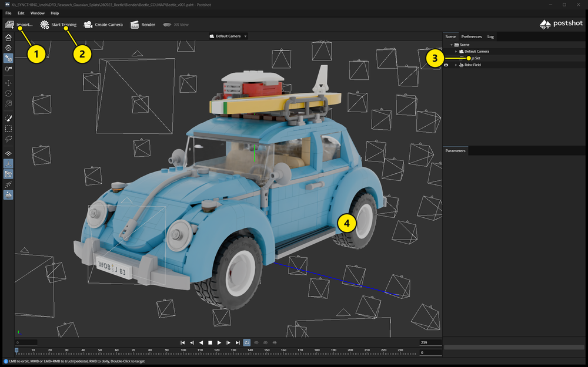

1. Press **Import…** and choose the dataset folder `Beetle_COLMAP/v001`.
2. Press **Start Training** and choose a training profile.
3. In the scene tree, *Image Set* is the dataset and *Rdnc Field* the trained radiance field –
   the splat.
4. The trained splat is shown together with the cameras of the dataset. Save the project
   (`Beetle_v001.psht` in the example) and export the splat for other programs.

**The results of this example** – both trained from the same dataset, to look at in the browser:
[Postshot on SuperSplat](https://superspl.at/scene/04caae8c) ·
[LichtFeld Studio in the LichtFeld gallery](https://portal.lichtfeld.io/gallery/s/S5BcEp7xgtTaVIfsgpa2ygW0Pg_zsnMm/)

Training continues to improve the splat after the maximum number of splats is reached: the
existing splats are still refined, and fine details usually settle in the second half of the run.

---

## What the dataset contains

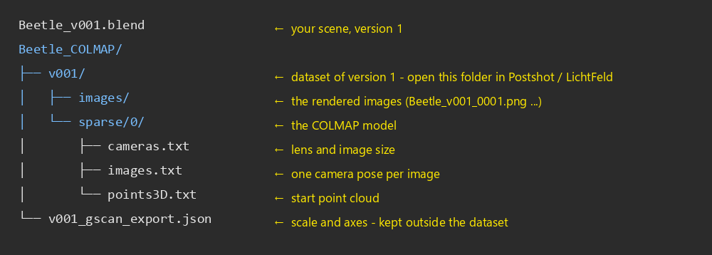

`images.txt` holds one pose per image, `cameras.txt` the lens and image size, `points3D.txt` the
start points. `v001_gcapture_export.json` – next to the dataset, not inside, because Postshot would
read any `.json` in the dataset as a camera file – records the scale and axis conversion of the
export, so a trained splat can be placed back onto the model in Blender.

See also: [Quick start](QUICKSTART.md) · [Reference of all settings](REFERENCE.md) ·
[Troubleshooting](TROUBLESHOOTING.md) · [Glossary](GLOSSARY.md)

---

*Transparency note on the use of AI: the author is not a programmer but has worked in CGI
since 1987. The add-on and this tutorial were developed entirely through vibe coding with
Anthropic Claude (Claude Code); concept, decisions, tests and acceptance by the author.*
