

# Tutorial – from a Blender model to a Gaussian Splat

This tuto­rial takes you through the whole work­flow once, step by step. It uses an LDraw model of a
clas­sic Beetle as exam­ple – set 10252, mod­elled by Roland Dahl (RolandD), CC BY 2.0; the file is in
[exam­ples/10252_Volkswagen_Beetle](../examples/10252_Volkswagen_Beetle/). The num­bers in brack­ets are
the values of that exam­ple.

**You need:** Blender 4.1 or later with the add-on installed ([Install](#0-install-the-add-on)),
a model you want to turn into a Gauss­ian Splat, and a Gauss­ian Splat­ting trainer –
[Post­shot](https://www.jawset.com/) or [LichtFeld Studio](https://github.com/MrNeRF/LichtFeld-Studio).

**Time:** about 15 min­utes of work. Ren­der­ing and train­ing run on their own after­wards.

**How the idea works:** a real Gauss­ian Splat is trained from many photos of an object taken from
all sides. The add-on does the same with a vir­tual camera: it places cam­eras on a sphere around
your model, ren­ders one image per camera and writes a *COLMAP dataset* – the images plus the exact
posi­tion of every camera and a cloud of start points. A trainer turns that dataset into a splat.
Because the camera posi­tions are known exactly, the usual photo-align­ment step is not needed.

Every step below has the same struc­ture: **what it is for**, the **num­bered actions** (the
num­bers match the yellow mark­ers in the pic­ture), a **check** that tells you it worked, and an
optional **why** for the curi­ous.

Con­tents: [0 Install](#0-install-the-add-on) · [Start the guide](#start-the-guide) ·
[1 Scene & Camera](#step-1-scene--camera) · [2 Look Target](#step-2-look-target) ·
[3 Group & Align](#step-3-group--align-to-ground) · [4 Camera Sphere](#step-4-camera-sphere) ·
[5 Build](#step-5-build-the-camera-animation) · [6 Render](#step-6-render) ·
[7 Export](#step-7-colmap-export) · [Train](#then-train-the-splat) ·
[8 Clean Splat](#step-8-clean-splat-after-training) · [The dataset](#what-the-dataset-contains)

---

## 0. Install the add-on

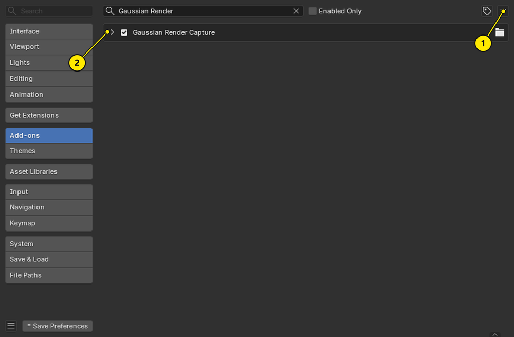

**[⬇ Latest release](https://github.com/virtualrepublic/Gaussian-Render-Capture/releases/latest)** – down­load `gaussian_capture-<version>.zip` there; do not unpack it.

1. *Edit → Pref­er­ences → Add-ons*, open the menu at the top right and choose
   **Install from Disk…**, then pick the ZIP. Blender 4.2 and later install it as an exten­sion.
2. Tick **Gauss­ian Render Capture** to enable it.

**Updat­ing:** restart Blender after installing a new ver­sion. Coming from 1.3.0 or older on
Blender 4.2 and later, first remove the old *Gauss­ian Render Capture* (`gaussian_capture.py`) in
the same list; on Blender 4.1 the ZIP replaces it.

**Check:** in the 3D view­port, press **N** – the side­bar has a tab **Gauss­ian Render Capture**.

> Blender 4.1 has the same button as *Install…* at the top of the Add-ons page.

---

## Start the guide

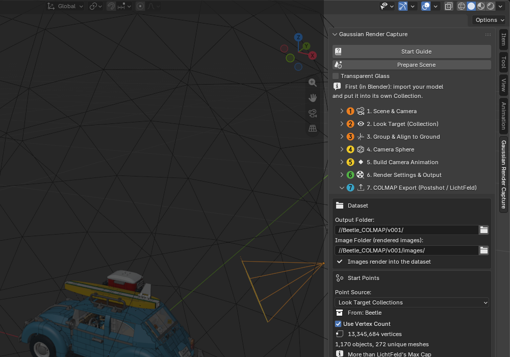

Import your model first and put it into a col­lec­tion of its own (*M → New Col­lec­tion* in the
view­port). Then open the side­bar tab **Gauss­ian Render Capture** and press **Start Guide**.

The guide shows one step at a time. Two colours tell you what to do:

- **Blue button** – this is the action the step needs. It stays blue until the step is done.
- **Red status line** at the bottom – some­thing is still miss­ing. It turns into a green tick when
  the step is com­plete, and **Next** turns blue.

You can leave the guide with **Exit** at any time; all sec­tions are then shown as a normal panel.

---

## Step 1: Scene & Camera

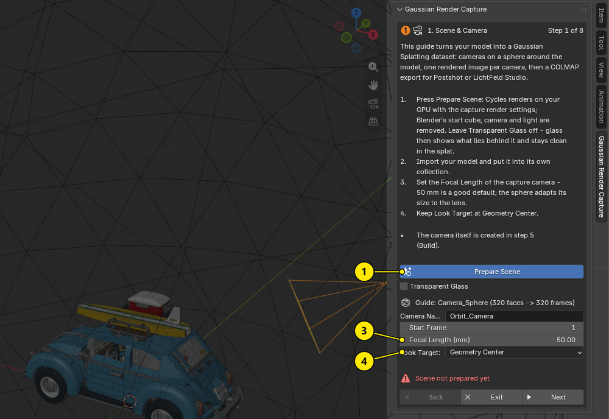

**What it is for:** sets Blender up for the cap­ture ren­ders and chooses the camera lens.

1. Press **Prepare Scene**. Cycles now ren­ders on your graph­ics card, with the render set­tings
   that suit a cap­ture (1024 sam­ples, denois­ing, trans­par­ent back­ground). Blender's start cube,
   camera and light are removed – only if you did not change them. Leave **Trans­par­ent Glass**
   below it off: glass then shows what lies behind it, e.g. a car's inte­rior, and stays clean in the
   splat. Switch it on only for objects that are mostly glass.
2. Import your model and put it into its own col­lec­tion (if not done yet).
3. Set the **Focal Length** of the cap­ture camera – 50 mm is a good default.
4. Keep **Look Target** at *Geom­e­try Center*.

**Check:** the status line says *Scene pre­pared (Cycles on GPU)*.

Why?

Prepare Scene chooses the fastest graph­ics card back­end it finds (OptiX, CUDA, HIP, Metal, oneAPI)
and switches the pro­ces­sor off for ren­der­ing. The camera itself is only cre­ated in step 5; the
sphere in step 4 adapts its size to the lens, so a longer lens simply moves the cam­eras fur­ther
away.

---

## Step 2: Look Target

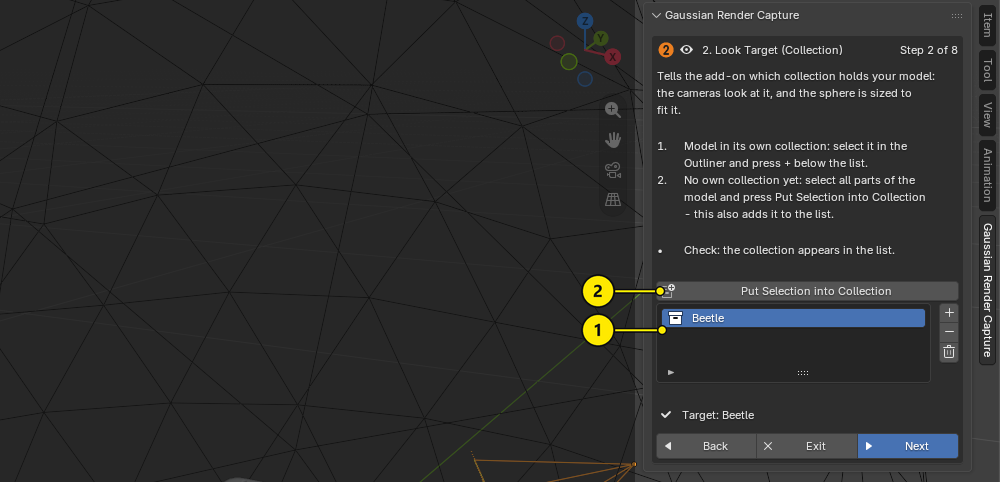

**What it is for:** tells the add-on which col­lec­tion holds your model. The cam­eras look at it and
the sphere is sized to fit it.

1. If your model already has its own col­lec­tion: select the col­lec­tion in the Out­liner and press
   **+** next to the list.
2. If not: select all parts of the model and press **Put Selec­tion into Col­lec­tion**. If a
   col­lec­tion of that name exists, it is used.

**Check:** the col­lec­tion appears in the list (*Beetle*), the status line shows *Target: Beetle*.
The view­port frames the model.

---

## Step 3: Group & Align to Ground

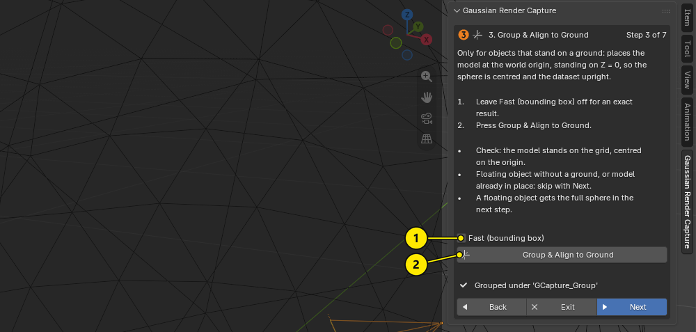

**What it is for:** *only for objects that stand on a ground.* Puts the model at the world origin,
stand­ing on Z = 0, so the sphere is cen­tred and the dataset stands upright.

1. Leave **Fast (bound­ing box)** off for an exact result.
2. Press **Group & Align to Ground**.

**Check:** the model stands on the grid, cen­tred on the origin; the status line says
*Grouped under 'GCapture_Group'*.

A float­ing object (no ground), or a model that is already in place: skip this step with **Next**.

---

## Step 4: Camera Sphere

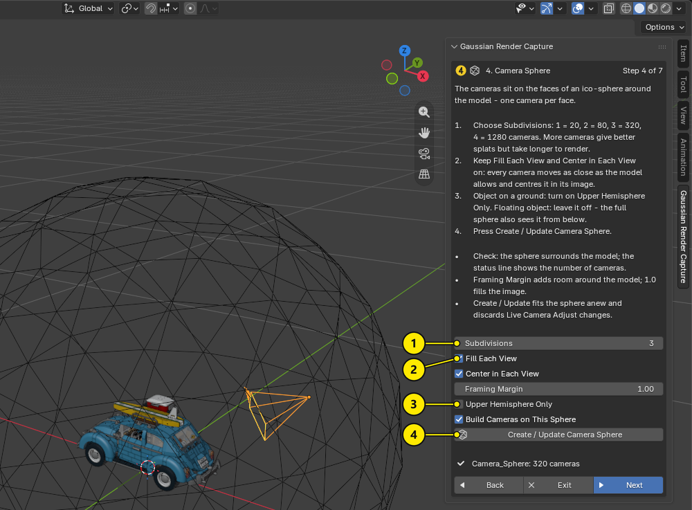

**What it is for:** cre­ates the sphere whose faces become the camera posi­tions – one camera per
face.

1. Choose **Sub­di­vi­sions**: 1 = 20, 2 = 80, **3 = 320** (exam­ple), 4 = 1280 cam­eras. More cam­eras
   give better splats but take longer to render.
2. Keep **Fill Each View** and **Center in Each View** on.
3. Object on a ground: turn on **Upper Hemi­sphere Only**. Float­ing object: leave it off – the
   full sphere also sees it from below.
4. Keep **Build Cameras on This Sphere** on and press **Create / Update Camera Sphere**.

**Check:** a wire­frame sphere sur­rounds the model; the status line shows *Camera_Sphere: 320
cam­eras*. Camera and sphere live in their own col­lec­tion *Capture_Rig*.

Why Fill Each View and Center in Each View?

With **Fill Each View** every camera moves along its line of sight until the model fills its
image – from the front the model is wider than from above, so each camera gets its own dis­tance.
**Center in Each View** also shifts every camera side­ways, keep­ing its direc­tion, until the model
sits in the middle of the square image. Together they give the most detail per image:

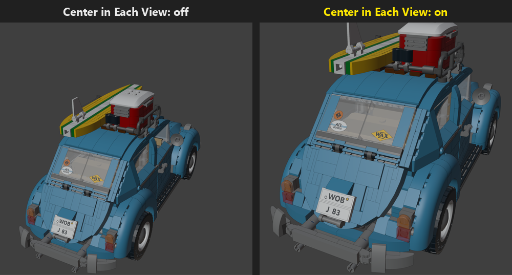

*Framing Margin* adds room around the model; 1.0 fills the image edge to edge.

---

## Step 5: Build the camera animation

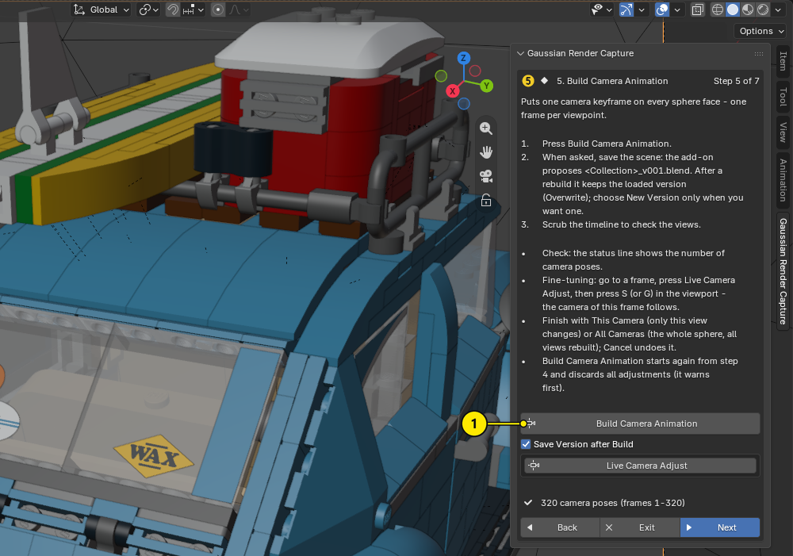

**What it is for:** cre­ates the cap­ture camera and gives it one keyframe per sphere face – frame 1 is
the first view, frame 320 the last.

1. Press **Build Camera Ani­ma­tion**.
2. The add-on asks you to save the scene as a *ver­sion* – see below.
3. Scrub the time­line to look at the views (numpad 0 shows the camera view).

**Check:** the status line shows *320 camera poses (frames 1–320)*.

### Saving versions

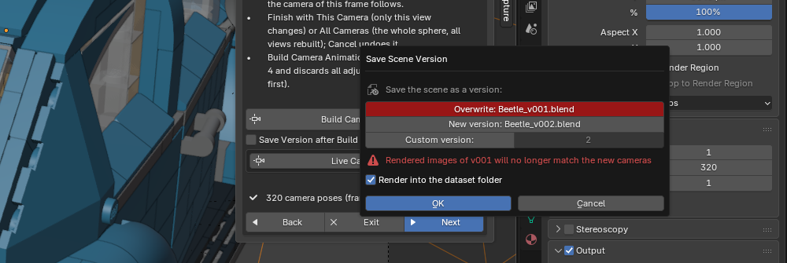

Every ver­sion of your scene gets its own dataset folder, so ren­ders and exports of dif­fer­ent
ver­sions never mix. The first save pro­poses `<Collection>_v001.blend` (here `Beetle_v001.blend`).
Later the dialog offers:

- **Over­write** (red) – keeps the loaded ver­sion. Offered only when the loaded file is the high­est
  ver­sion in the folder.
- **New ver­sion** (blue when chosen) – the next free number, e.g. `Beetle_v002.blend`.
- **Custom ver­sion** – a number of your choice.

Keep **Render into the dataset folder** on: the render output then goes straight into the
dataset of this ver­sion. If you render into a folder of your own (set in the Output tab), the
dialog leaves it alone.

### Fine-tuning single views: Live Camera Adjust

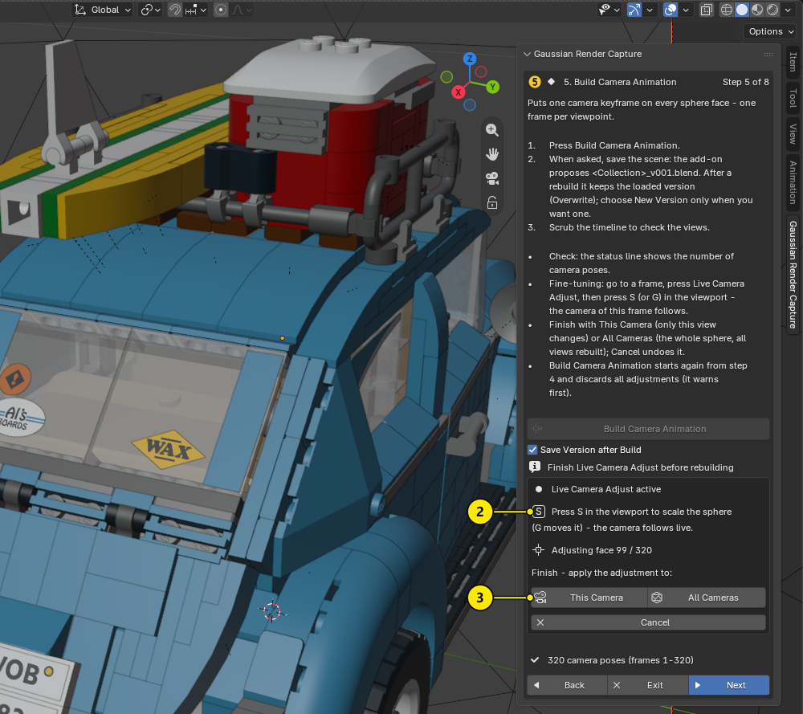

1. Go to the frame whose view you want to change and press **Live Camera Adjust**.
2. Press **S** (scale) or **G** (move) in the view­port – the camera of this frame fol­lows the
   sphere.
3. Finish with **This Camera** (only this view changes), **All Cameras** (the whole sphere, all
   views are rebuilt) or **Cancel**.

Press­ing **Build Camera Ani­ma­tion** again starts over from the step 4 set­tings and dis­cards all
adjust­ments – the panel shows a red warn­ing and Build asks before it does so.

---

## Step 6: Render

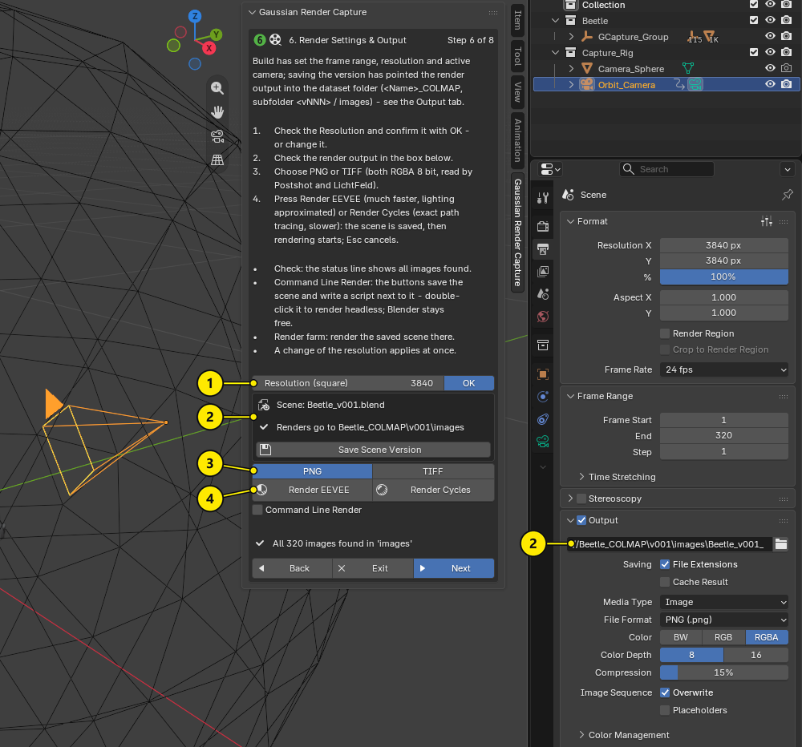

**What it is for:** ren­ders one image per camera into the dataset folder.

1. Check the **Res­o­lu­tion** and con­firm it with **OK** – or change it (exam­ple: 3840 px).
2. Check the render output: the box says `Renders go to Beetle_COLMAP\v001\images`. The guide has
   opened the **Output** tab, where you see the same path.
3. Choose the image format: **PNG** or **TIFF** (both RGBA 8 bit; TIFF files are smaller). Post­shot
   and LichtFeld Studio read both.
4. Render the images: press **Render EEVEE** (much faster, light­ing approx­i­mated) or
   **Render Cycles** (exact path trac­ing, slower). The button saves the scene first, so set­tings
   you changed just before are kept; then Blender's render window shows the progress. **Esc**
   can­cels. On a
   render farm, render the saved scene there instead.

   *Command Line Render* (head­less): with this option the but­tons read **Write EEVEE .cmd** /
   **Write Cycles .cmd**. They save the scene and write a script next to it, e.g.
   `Beetle_v001_render_eevee.cmd`. Double-click it to render with­out Blender's inter­face –
   Blender stays free, and the render goes on when you close Blender. On macOS the script is a
   `.command`, on Linux a `.sh`.

How does Command Line Render work – on Windows, macOS and Linux?

The script starts Blender with­out its inter­face:
`blender -b <Scene>.blend -a` (plus `-- --cycles-device <GPU>` for Cycles).
`-b` loads the scene in the back­ground, `-a` ren­ders the whole ani­ma­tion with the frame range,
engine, res­o­lu­tion and output path **of the saved file** – that is why the but­tons save first.
The ter­mi­nal shows the progress frame by frame; **Ctrl+C** can­cels. The script calls exactly the
Blender that wrote it, so it runs on the system where it was writ­ten.

- **Windows** – double-click the `.cmd`. The window stays open at the end until you press a key.
- **macOS** – double-click the `.command`; the Finder runs it in the Ter­mi­nal. Cycles and EEVEE
  render through Metal, no dis­play needed. The first time, macOS may refuse a file from an
  uniden­ti­fied devel­oper: right-click → *Open* and con­firm once.
- **Linux** – double-click the `.sh` if your file man­ager may run scripts, oth­er­wise run
  `./<Scene>_render_eevee.sh` in a ter­mi­nal. Cycles also ren­ders on a machine with­out a dis­play
  (e.g. over SSH). EEVEE needs a graph­ics ses­sion; on a server with­out a dis­play start it through
  a vir­tual one: `xvfb-run -a ./<Scene>_render_eevee.sh`. To keep it run­ning after you log out:
  `nohup ./<Scene>_render_cycles.sh &`.

If Blender's inter­face stays open during the render, both share the graph­ics card and its memory –
for large scenes close the inter­face.

**Check:** the status line turns green: *All 320 images found in 'images'*.

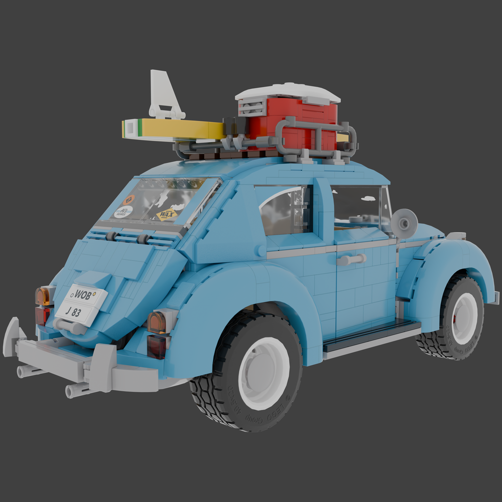

*One of the 320 ren­dered views. The back­ground is trans­par­ent; the trainer only learns the model.*

Why square images and a transparent background?

All cam­eras use the same square image, so the model can fill every view equally. The trans­par­ent
back­ground keeps the splat free of floaters around the model. The render set­tings for this come
from *Prepare Scene*; the switches that make the scene render exactly one image per camera are
under *Advanced → Render Setup* and should stay on.

---

## Step 7: COLMAP Export

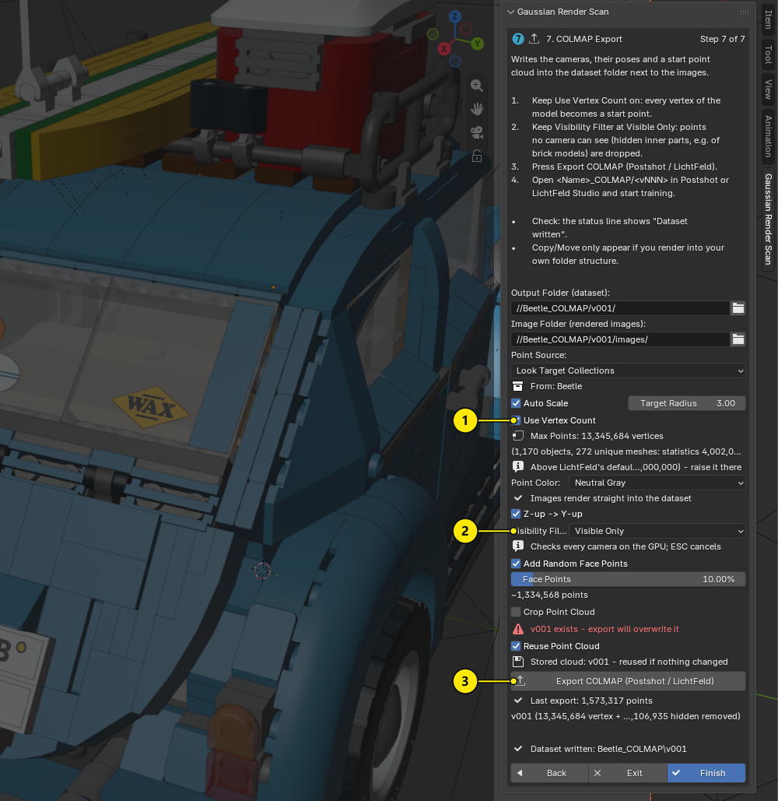

**What it is for:** writes the camera poses and a start point cloud next to the images – the
fin­ished dataset for the trainer.

The panel groups the set­tings into **Dataset** (where the dataset and the images are),
**Start Points** (what goes into the point cloud) and **Scale & Axes**. The defaults fit most
models; while the export runs, a progress bar replaces the button and **Esc** can­cels.

1. Keep **Use Vertex Count** on: every vertex of the model becomes a start point.
2. Keep **Vis­i­bil­ity Filter** at **Visible Only**: points no camera can see (hidden inner parts)
   are dropped.
3. Press **Export COLMAP (Post­shot / LichtFeld)**.

**Check:** the status line shows `Dataset written: Beetle_COLMAP\v001`. The report at the bottom of Blender
names the number of points and the scale.

What do the fields mean?

- **Output Folder** and **Image Folder** show the real paths of this ver­sion
  (`//Beetle_COLMAP/v001/` and `.../images/`). They follow the ver­sion auto­mat­i­cally; a folder you
  type in your­self is left alone.
- **Point Source** – the start points come from the look-target col­lec­tion (*From: Beetle*).
- **Add Random Face Points** adds points on large flat faces, 10 % of the vertex points by default.
- **Auto Scale** scales the dataset so the cam­eras are on aver­age 3 units away from the centre.
  Very small or very large scenes den­sify badly in Post­shot. The factor (exam­ple: 7.83 – the cam­eras
  orbit only 38 cm from the centre of this small model) is writ­ten to `v001_gcapture_export.json` next to the dataset
  folder.
- **Reuse Point Cloud** copies the last point cloud if noth­ing changed that affects it.

In the exam­ple 13.3 mil­lion ver­tices plus 1.3 mil­lion face points went in; the vis­i­bil­ity filter
removed 13.1 mil­lion hidden points (inside the bricks), 1.57 mil­lion remained.

---

## Then: train the splat

Open the dataset folder of the ver­sion – `Beetle_COLMAP/v001`, the folder that con­tains `images`
and `sparse` – in your trainer.

### LichtFeld Studio

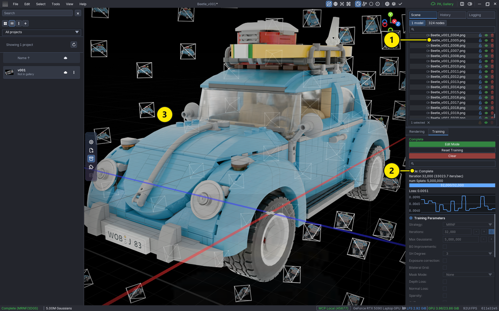

1. Load the dataset folder `Beetle_COLMAP/v001` in LichtFeld Studio. The 320 images appear in the
   scene list.
2. Start the train­ing in the **Train­ing** tab. The exam­ple ran with the defaults: strat­egy MRNF,
   32,000 iter­a­tions, at most 5,000,000 splats.
3. When it says *Com­plete*, the trained splat is shown together with all cam­eras (the small
   frames with the images). Save the project and export the splat, for exam­ple as `.ply` or
   `.sog` – in the exam­ple `Beetle_v001.licht` and `Model_32000.sog`.

From a com­mand line the same train­ing runs with
`LichtFeld-Studio.exe -d "<path>/Beetle_COLMAP/v001" -o "<output folder>"`.

### Postshot

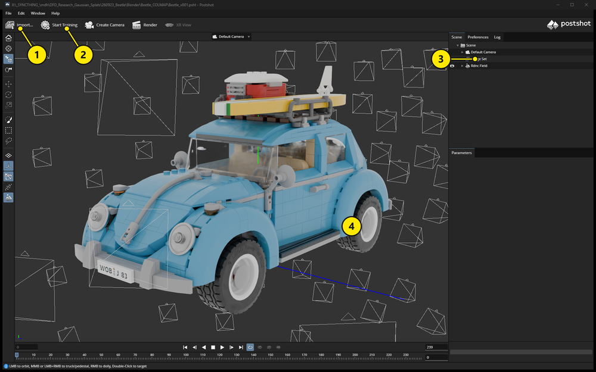

1. Press **Import…** and choose the dataset folder `Beetle_COLMAP/v001`.
2. Press **Start Train­ing** and choose a train­ing pro­file.
3. In the scene tree, *Image Set* is the dataset and *Rdnc Field* the trained radi­ance field –
   the splat.
4. The trained splat is shown together with the cam­eras of the dataset. Save the project
   (`Beetle_v001.psht` in the exam­ple) and export the splat for other pro­grams.

**The results of this exam­ple** – both trained from the same dataset, to look at in the browser:
[Post­shot on SuperSplat](https://superspl.at/scene/04caae8c) ·
[LichtFeld Studio in the LichtFeld gallery](https://portal.lichtfeld.io/gallery/s/S5BcEp7xgtTaVIfsgpa2ygW0Pg_zsnMm/)

Train­ing con­tin­ues to improve the splat after the max­i­mum number of splats is reached: the
exist­ing splats are still refined, and fine details usu­ally settle in the second half of the run.

---

## Step 8: Clean Splat (after training)

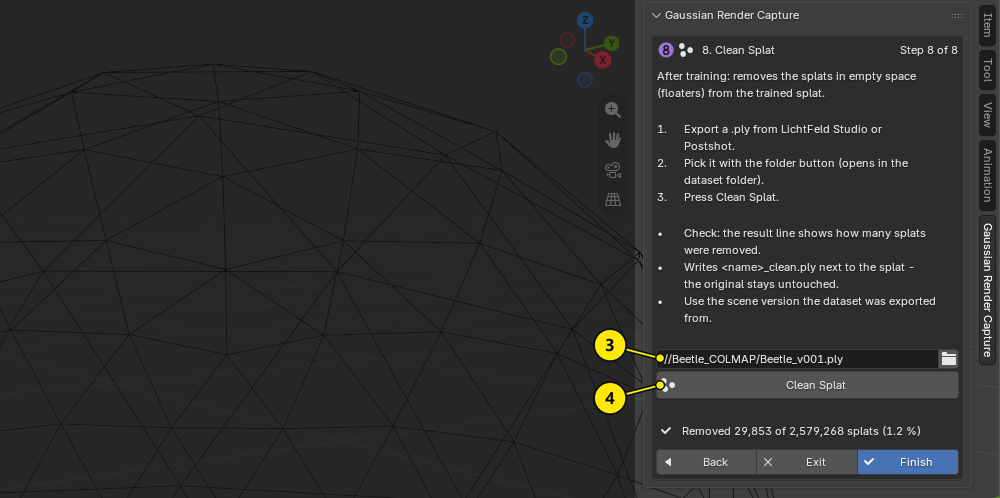

**What it is for:** removes the splats in empty space – floaters around the model, in its cav­i­ties
and behind the cam­eras – from the splat you trained in LichtFeld Studio or Post­shot.

1. Export the trained splat as `.ply` from your trainer.
2. Open the scene ver­sion the dataset was exported from (e.g. `Beetle_v001.blend`).
3. Click the folder button next to *Splat File* and pick the `.ply` – the file browser opens in the
   dataset folder.
4. Press **Clean Splat**. Every camera of the dataset sees the model's depth; a splat in front of
   the sur­face in at least two cam­eras, or seen by no camera, goes. The result line says how many
   splats were removed; `<name>_clean.ply` is writ­ten next to your file, the orig­i­nal stays.

Nothing is ren­dered: the GPU draws the depth of the model per camera, which takes a few sec­onds.
Splats directly on the sur­face stay, as do the splats of a ren­dered floor or back­drop. *Min. Views*
under **Advanced** sets how many cam­eras must see a splat in front of the sur­face (default 2).

---

## What the dataset contains

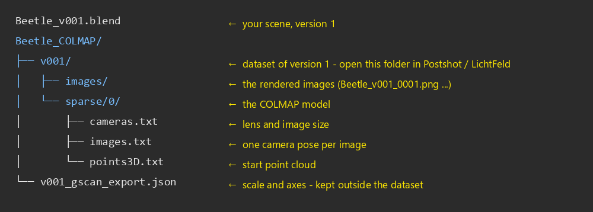

`images.txt` holds one pose per image, `cameras.txt` the lens and image size, `points3D.txt` the
start points. `v001_gcapture_export.json` – next to the dataset, not inside, because Post­shot would
read any `.json` in the dataset as a camera file – records the scale and axis con­ver­sion of the
export, so a trained splat can be placed back onto the model in Blender.

See also: [Quick start](QUICKSTART.md) · [Ref­er­ence of all set­tings](REFERENCE.md) ·
[Trou­bleshoot­ing](TROUBLESHOOTING.md) · [Glos­sary](GLOSSARY.md)

---

*Trans­parency note on the use of AI: the author is not a pro­gram­mer but has worked in CGI
since 1987. The add-on and this tuto­rial were devel­oped entirely through vibe coding with
Anthropic Claude (Claude Code); con­cept, deci­sions, tests and accep­tance by the author.*

